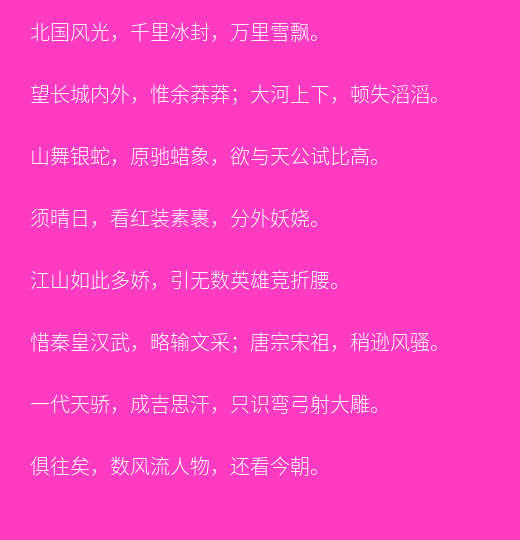

# image-class
基于imagick的图像处理类

设计初衷：大多数时候，从GD创建图像操作繁琐，执行效率低下，imagick执行效率比GD高，

项目不依赖任何框架，因此你可以与你的任何项目集成。

项目依赖php-imagick扩展，

安装前请确保安装了php-imagick
- debian/ubuntu sudo apt install php-imagick

安装项目：
- composer require hahadu/image-factory

##已实现的功能模块：
>（按开发顺序排序）
* 图像转文字像素 [此模块旧版](https://github.com/hahadu/image-to-text)
* 创建图像缩略图
* 根据文字前两个字符创建头像(.png)和图标(.icon)
* 给图像添加文字水印
* 从文本创建图像
* 给图像添加图像水印
项目使用过程有任何问题欢迎issues,或qq：582167246联系


##使用方法
* 引入命名空间
```php
use Hahadu\ImageFactory\Config\Config;
use Hahadu\ImageFactory\Kernel\Factory;

```
* 图像转文字像素

```php
//
        $image = 'iphonex.jpg';
        $config = new Config(); //获取配置信息
        $config->chars = '01';
        Factory::setOptions($config);
        //返回html
        echo Factory::image_to_text()->to_text_black($image);
        echo Factory::image_to_text()->to_text_color($image);

```
* 创建缩略图
```
        $image = 'image.png';
        $config = new Config();
        $config->savePath = 'images/thumb/'; //配置缓存目录
        Factory::setOptions($config);
        //thumb 四个参数 
        //其中设置$path参数会覆盖$config->savePath;null即可
        //返回文件路径
        $thumb_url = thumb($image=$image,$path='',$width=100,$height=100);

        echo '';

```
* 根据文本前两个字符串创建头像
- > 注意:汉字目前只截取第一个字符，字母截取前两个字符，汉字与英文字母同时只能存在一个
  > 添加中文到图像需要设置中文字体支持，默认使用SourceHanSansCN-Light字体
```php
        $config = new Config();
        $config->savePath = 'images/';
        $config->fonts = ''; //设置字体，不设置留空即可，SourceHanSansCN-Light
        Factory::setOptions($config);
        //生成.png格式头像
        $avatar_url = Factory::text_to_image()->text_to_icon('HahaDu'); //截取：Ha
        echo '';
        //生成.icon格式图标
        $icon_url = Factory::text_to_image()->text_to_icon('哈哈'); //截取：哈
        echo '';
```
* 框架内置字体调用方法：
```php
Factory::base()->get_font_path($fontname='SourceHanSansCN-Light.otf');
```
* 图像添加文字水印
```php
        $image = 'iphonex.jpg';
        $config = new Config();
        $config->setSavePath = 'images/';
        $config->waterMarkText = 'power by hahadu/image-factory'; //设置水印文字，支持\n换行符
        $config->TextStyle = [
        //支持的配置项
            'font' =>'雅黑.ttf',//字体,需要指定字体路径
            'font_size' => 20, //字体大小
            'font_weight' => 500, //字体粗细
            'fill_color' => '#ffffffff',//字体颜色，支持标准色值，
            'under_color' => '#ffffffff',//背景颜色，支持标准色值
            'fill_opacity' => '0.5', //浮点数0-1，透明度，这里设置透明度会覆盖fill_color中的透明度
        ];
        Factory::setOptions($config);
        /*
         * @param string|null $image 图像路径
         * @param string|float $x 水印位置横向坐标 数字 字符串目前支持' left '、' right '、' center '
         * @param string|float $y 水印位置纵向坐标 数字 字符串目前支持' top '、' down '、' center '
         * @param array $option 自定义设置，覆盖config->TextStyle[]设置,
         * 如果$option['waterMarkText']存在则覆盖$config->waterMarkText中设置的默认值
         * 如果$option['path'] 存在则覆盖$config->setSavePath
         * 区分大小写
         */
        $text_water_mark = Factory::text_to_image()->TextAddImage->water_mark($image,$x='right',$y='down',$option=[]);
        echo  '';

```
* 从文本创建图像
```php
        $config = new Config();
        $config->setSavePath = 'images/';
        Factory::setOptions($config);
        //设置文本
        $text  ="北国风光，千里冰封，万里雪飘。\n
望长城内外，惟余莽莽；大河上下，顿失滔滔。\n
山舞银蛇，原驰蜡象，欲与天公试比高。\n
须晴日，看红装素裹，分外妖娆。\n
江山如此多娇，引无数英雄竞折腰。\n
惜秦皇汉武，略输文采；唐宗宋祖，稍逊风骚。\n
一代天骄，成吉思汗，只识弯弓射大雕。\n
俱往矣，数风流人物，还看今朝。\n";

        $option=[
            'background' => '#ff3cc1', //背景颜色
            'fill_color' => '#fff', //文字颜色
            'font_size'=> '20', //文字大小
        //    'image_width'=>80, //图片宽度
        //    'image_height'=>80, //图片高
        //    'filename' => 'a_test_image', //文件名
            'format' => 'jpg', //文件格式后缀
        ];
        //此处option设置对应值会覆盖$config->TextStyle中的默认值
        $text_mark_url = Factory::text_to_image()->text_create_image($text,$option);
        echo '';

```


* 添加图片水印
```php
        $image = 'iphonex.jpg';

        $config = new Config();
        $config->setSavePath = 'images/';
        $config->waterMarkImage='dd.png';
        Factory::setOptions($config);

        $option=[
            'format' => 'jpg', //文件格式后缀
            'opacity' => 5,//设置图像透明度,值越大可见度越低，目前仅支持带alpha通道的图片
            'path' => '' //自定义文件保存路径，此处会覆盖$config->setSavePath
        ];

        $img_mark_url = Factory::image_to_image()->image_water_mark($image,$x='right',$y='down',$path=null,$option);
        return '';

```